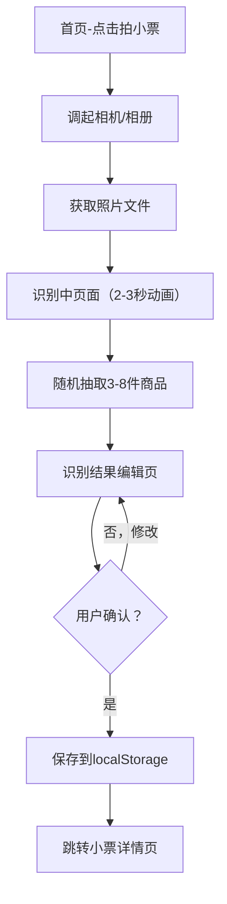

## 1. 产品概述

小票管家是一款运行在手机浏览器中的轻量H5工具，帮助用户将纸质购物小票拍照存档，模拟提取商品信息并自动计算食品保质期。当商品临期或过期时，通过页面顶部提醒栏通知用户，避免食物浪费。所有数据存储在浏览器本地，无需注册或联网。

- **核心价值**：减少食物浪费，管理家庭食品库存，延长食品保质期意识
- **目标用户**：家庭主妇、独居青年、注重食品健康的消费者
- **产品定位**：纯前端离线H5应用，零门槛使用，数据本地加密存储

---

## 2. 核心功能

### 2.1 用户角色
本产品无角色区分，所有用户均为普通使用者，无需注册登录。

| 角色 | 注册方式 | 核心权限 |
|------|----------|----------|
| 普通用户 | 无需注册，直接使用 | 所有功能完整可用，数据仅存本地 |

### 2.2 功能模块
1. **首页**：临期/过期商品提醒看板、三卡片统计、紧急商品列表、快速拍照入口
2. **小票页**：小票列表（按月分组）、小票详情、左滑删除、拍照/手动录入入口
3. **商品页**：商品汇总、分类筛选、到期排序、搜索、商品详情
4. **我的页**：统计数据、默认保质期管理、提醒设置、数据清除、分享长图
5. **拍照识别流程**：拍照/选图 → 识别动画 → 结果编辑 → 保存
6. **手动录入流程**：填写购物信息 → 添加商品 → 保存

### 2.3 页面详情
| 页面名称 | 模块名称 | 功能描述 |
|----------|----------|----------|
| 首页 | 顶部提醒横幅 | 当日到期/已过期商品提醒，当日仅显示一次，可关闭 |
| 首页 | 三数字卡片 | 已过期（红）、今日到期（橙）、未来3天到期（黄） |
| 首页 | 紧急商品列表 | 按紧急程度排序，显示名称、到期日、剩余天数、来源小票 |
| 首页 | 拍小票按钮 | 顶部醒目CTA按钮，调起相机 |
| 首页 | 空状态引导 | 无小票时展示拍照引导图 |
| 小票页 | 月份分组列表 | 按购物月份分组，显示商店、日期、件数、总金额 |
| 小票页 | 左滑删除 | 左滑露出删除按钮，二次确认后删除整单 |
| 小票页 | 添加入口 | 拍照录入、手动录入两个按钮 |
| 小票详情页 | 小票照片 | 顶部显示小票原图，可放大 |
| 小票详情页 | 商品列表 | 显示所有商品及剩余天数颜色标签 |
| 小票详情页 | 商品操作 | 标记已处理、查看详情 |
| 商品页 | 分类Tab | 8大分类筛选（乳制品、肉类、蔬菜、水果、零食、饮料、调味品、其他） |
| 商品页 | 排序切换 | 按到期日排序（临期优先） |
| 商品页 | 搜索框 | 关键字搜索商品名称 |
| 商品详情页 | 完整信息 | 名称、分类、生产日期、到期日、数量、来源小票、备注 |
| 商品详情页 | 编辑功能 | 修改保质期参数、添加备注 |
| 我的页 | 统计面板 | 总小票数、商品种类数、本月预估节省金额 |
| 我的页 | 功能入口 | 手动录入、默认保质期库、提醒设置、清除数据 |
| 我的页 | 分享功能 | 生成"我的冰箱清单"Canvas长图 |
| 识别中页 | 扫描动画 | 显示原图、扫描线动画、进度条，2-3秒 |
| 识别结果页 | 商品编辑列表 | 可修改名称、数量、单价，增删条目 |
| 手动录入页 | 表单输入 | 购物日期、商店名称、逐条添加商品 |

---

## 3. 核心流程

### 3.1 拍照识别流程
用户点击"拍小票"按钮 → 调用手机相机/相册 → 选择照片 → 进入识别中页面（扫描动画2-3秒） → 随机生成3-8件商品 → 用户可编辑/增删商品 → 确认保存 → 小票和商品数据存入localStorage → 跳转小票详情页

### 3.2 手动录入流程
用户在小票页或我的页点击"手动添加" → 填写购物日期、商店名称 → 逐条添加商品（名称、数量、单价、生产日期、保质期天数） → 自动匹配默认保质期 → 确认保存 → 生成小票记录

### 3.3 保质期提醒流程
每次页面加载 → 遍历所有未处理商品 → 计算剩余天数 → 更新首页三卡片 → 检查当日是否有到期/过期商品 → 检查当日是否已提醒 → 未提醒则显示顶部横幅 → 记录已提醒状态

---

## 4. 用户界面设计

### 4.1 设计风格
- **主题色调**：清新绿色系（食品健康感）+ 暖橙辅助色（提醒）+ 红色警示（过期）
  - 主色：`#10B981`（翡翠绿）
  - 辅助色：`#F59E0B`（琥珀橙）
  - 警示色：`#EF4444`（鲜红）
  - 背景色：`#F9FAFB`（浅灰白）
- **按钮风格**：圆角胶囊按钮（rounded-full），主色渐变，点击反馈微缩放
- **字体**：系统字体优先（PingFang SC、SF Pro Display），标题加粗，正文常规
- **布局风格**：卡片式布局，大圆角（rounded-2xl），柔和阴影
- **图标风格**：Lucide线性图标，统一描边2px

### 4.2 页面设计概述
| 页面名称 | 模块名称 | UI元素 |
|----------|----------|--------|
| 首页 | 三卡片统计 | 三色横向排列卡片，数字大号加粗，下方说明文字，渐变背景 |
| 首页 | 紧急商品列表 | 卡片列表，左侧圆形状态标签，右侧剩余天数，点击反馈 |
| 首页 | 拍小票按钮 | 固定浮动按钮，绿色渐变，相机图标+文字 |
| 小票页 | 月份分组 | 月份标题条（左侧色条），组内卡片垂直堆叠 |
| 小票页 | 小票卡片 | 商店名粗体，日期灰色小字，右下角总金额高亮 |
| 商品页 | 分类Tab | 横向滚动胶囊Tab，选中态绿色填充 |
| 商品页 | 商品卡片 | 左侧分类图标，中间信息，右侧剩余天数色块 |
| 我的页 | 统计面板 | 三列数字网格，分隔线 |
| 我的页 | 功能列表 | 左侧图标+文字，右侧箭头，分组管理 |
| 识别中页 | 扫描动画 | 图片叠加半透明蒙层，扫描线上下移动，进度条渐变填充 |
| 识别结果页 | 编辑列表 | 每行可点击编辑，右侧增减数量按钮，删除图标 |

### 4.3 响应式设计
- **移动端优先**：所有设计以375px宽度为基准，适配iPhone SE到iPhone Pro Max
- **触摸优化**：所有可点击区域最小高度44px，列表项行高≥56px
- **最大宽度限制**：在桌面浏览器中，内容区最大宽度480px居中显示
- **横竖屏适配**：竖屏优化为主，横屏时维持最大宽度限制

### 4.4 状态颜色标签
| 状态 | 剩余天数 | 颜色 | 色值 |
|------|----------|------|------|
| 已过期 | < 0天 | 红色 | `#EF4444` |
| 紧急 | 0天（今日到期） | 深橙 | `#F97316` |
| 临期 | 1-7天 | 橙色 | `#F59E0B` |
| 注意 | 8-30天 | 黄色 | `#EAB308` |
| 正常 | > 30天 | 绿色 | `#10B981` |
