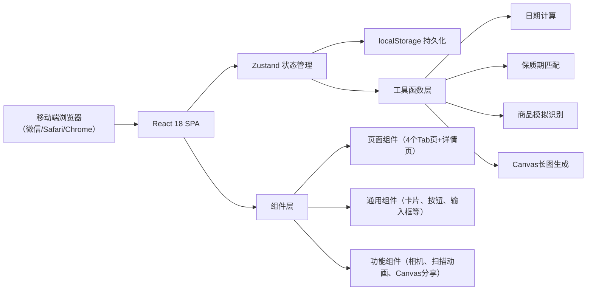
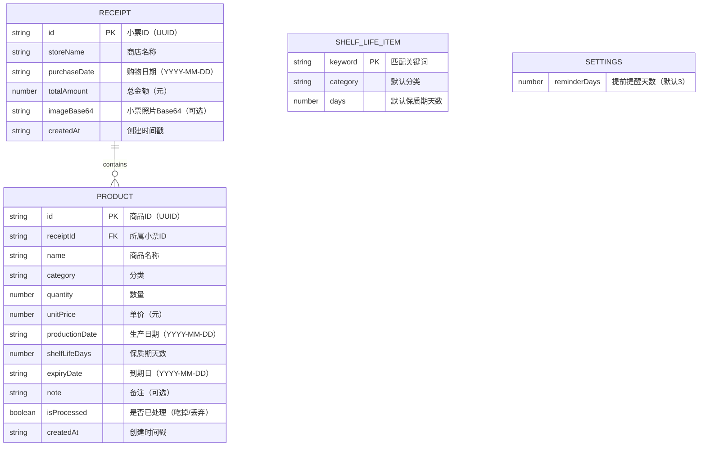

## 1. 架构设计

本产品为纯前端H5应用，无后端服务，所有数据存储在浏览器localStorage中。



---

## 2. 技术描述

- **前端框架**：React 18 + TypeScript 5
- **构建工具**：Vite 5
- **路由管理**：react-router-dom 6（HashRouter，适配静态部署）
- **状态管理**：Zustand 4（轻量，支持localStorage中间件）
- **样式方案**：TailwindCSS 3
- **图标库**：lucide-react
- **存储方案**：localStorage（容量≤5MB，Base64图片压缩后存储）

### 2.1 项目初始化
```bash
npm init vite-init@latest -y . -- --template react-ts --force
```

---

## 3. 路由定义

| 路由路径 | 页面组件 | 用途 |
|----------|----------|------|
| `/` | HomePage | 首页-提醒看板与快速入口 |
| `/receipts` | ReceiptsPage | 小票列表页 |
| `/receipts/:id` | ReceiptDetailPage | 小票详情页 |
| `/products` | ProductsPage | 商品汇总页 |
| `/products/:id` | ProductDetailPage | 商品详情页 |
| `/profile` | ProfilePage | 我的页面 |
| `/scan` | ScanPage | 拍照识别流程页（多步骤） |
| `/manual` | ManualEntryPage | 手动录入小票页 |
| `/shelf-life` | ShelfLifePage | 默认保质期管理页 |
| `/settings` | SettingsPage | 提醒设置页 |

---

## 4. API定义（无后端）

本产品无后端API，所有"数据操作"通过localStorage封装完成：

| 存储键名 | 数据结构 | 说明 |
|----------|----------|------|
| `receipts` | `Receipt[]` | 小票数组 |
| `products` | `Product[]` | 商品数组（冗余存储，便于查询） |
| `shelfLifeDefaults` | `ShelfLifeItem[]` | 默认保质期库 |
| `settings` | `Settings` | 用户设置（提前提醒天数等） |
| `reminderBannerDate` | `string` | 当日提醒日期（YYYY-MM-DD），避免重复提醒 |

---

## 5. 数据模型

### 5.1 数据模型定义（ER图）



### 5.2 TypeScript类型定义

```typescript
// 商品分类枚举
type ProductCategory = 
  | 'dairy'      // 乳制品
  | 'meat'       // 肉类
  | 'vegetable'  // 蔬菜
  | 'fruit'      // 水果
  | 'snack'      // 零食
  | 'beverage'   // 饮料
  | 'seasoning'  // 调味品
  | 'other';     // 其他

interface Receipt {
  id: string;
  storeName: string;
  purchaseDate: string;    // YYYY-MM-DD
  totalAmount: number;
  imageBase64?: string;
  createdAt: string;       // ISO timestamp
}

interface Product {
  id: string;
  receiptId: string;
  name: string;
  category: ProductCategory;
  quantity: number;
  unitPrice: number;
  productionDate: string;  // YYYY-MM-DD
  shelfLifeDays: number;
  expiryDate: string;      // YYYY-MM-DD, productionDate + shelfLifeDays
  note?: string;
  isProcessed: boolean;
  createdAt: string;
}

interface ShelfLifeItem {
  keyword: string;         // 匹配关键词，如"牛奶"
  category: ProductCategory;
  days: number;
}

interface Settings {
  reminderDays: number;    // 默认3天
}
```

### 5.3 预置数据

#### 5.3.1 默认保质期库（50+食品）

| 关键词 | 分类 | 保质期（天） |
|--------|------|-------------|
| 牛奶 | dairy | 7 |
| 酸奶 | dairy | 21 |
| 奶酪 | dairy | 180 |
| 黄油 | dairy | 90 |
| 猪肉 | meat | 3 |
| 牛肉 | meat | 3 |
| 鸡肉 | meat | 2 |
| 鱼 | meat | 2 |
| 虾 | meat | 2 |
| 培根 | meat | 7 |
| 生菜 | vegetable | 3 |
| 白菜 | vegetable | 7 |
| 番茄 | vegetable | 7 |
| 黄瓜 | vegetable | 5 |
| 胡萝卜 | vegetable | 14 |
| 土豆 | vegetable | 30 |
| 洋葱 | vegetable | 30 |
| 青椒 | vegetable | 7 |
| 西兰花 | vegetable | 5 |
| 菠菜 | vegetable | 3 |
| 苹果 | fruit | 14 |
| 香蕉 | fruit | 5 |
| 橙子 | fruit | 14 |
| 葡萄 | fruit | 7 |
| 草莓 | fruit | 3 |
| 西瓜 | fruit | 7 |
| 梨 | fruit | 14 |
| 芒果 | fruit | 7 |
| 饼干 | snack | 180 |
| 薯片 | snack | 90 |
| 巧克力 | snack | 365 |
| 面包 | snack | 7 |
| 蛋糕 | snack | 3 |
| 方便面 | snack | 180 |
| 火腿肠 | snack | 90 |
| 矿泉水 | beverage | 365 |
| 可乐 | beverage | 180 |
| 果汁 | beverage | 7 |
| 啤酒 | beverage | 180 |
| 酱油 | seasoning | 365 |
| 醋 | seasoning | 365 |
| 盐 | seasoning | 1095 |
| 糖 | seasoning | 730 |
| 料酒 | seasoning | 365 |
| 蚝油 | seasoning | 180 |
| 番茄酱 | seasoning | 180 |
| 罐头 | other | 365 |
| 大米 | other | 180 |
| 面粉 | other | 180 |
| 鸡蛋 | other | 30 |

#### 5.3.2 首次使用示例小票

首次进入应用时，自动插入一张示例小票，包含5件不同状态的商品：
1. 鸡蛋（30枚）- 生产日期45天前 → **已过期**
2. 牛奶（1L）- 生产日期7天前 → **今日到期**
3. 酸奶 - 生产日期4天前 → **临期（剩3天）**
4. 苹果（500g）- 生产日期3天前 → **注意（剩11天）**
5. 饼干 - 生产日期1天前 → **正常（剩179天）**
